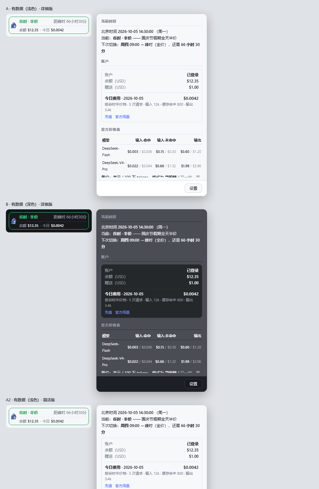
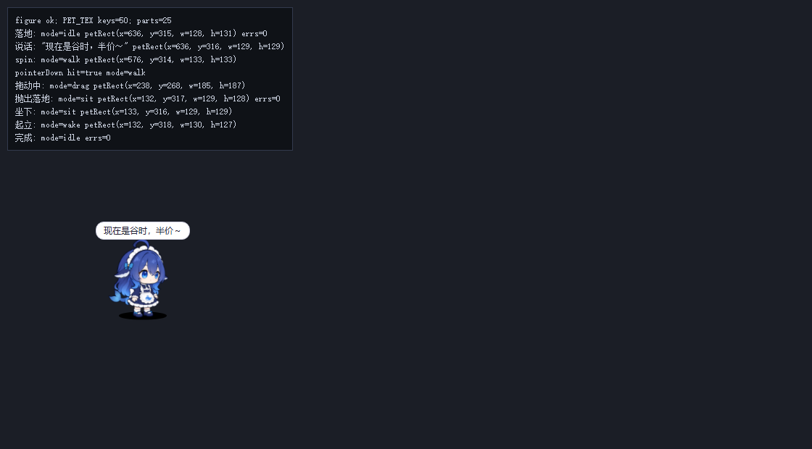

# dsh-deepseek-peak-whale 🐋

> 在DeepSeek Harness里养一只 鲸鱼娘 ：她告诉你 DeepSeek 现在是不是**半价**，
> 侧栏挂着**余额 · 今日费用**，平时在窗口底部自由走动、坐下、打盹、眼睛跟着你鼠标转，
> 还能**拎起来拖、甩出去、摸头顺毛**；写完提示词把她**拖到输入框上松手**，她替你优化好再写回。


**侧栏状态条 + 详情浮层**（浅色/深色 · 简洁版/详细版）：



**桌宠**（落地 → 念台词 → 拖拽互动）：



两个挂载点：

| 位置 | 内容 |
|---|---|
| 侧栏底部（账号位上方） | **价格状态条**：谷时/峰时、距切换倒计时、**余额 · 今日费用**；点击弹出完整价格表 + 账户卡片 |
| 全屏浮层 | **鲸鱼娘桌宠**：自由漫游、互动把玩、按峰谷念台词 |

```
（侧栏展开时）  [🐋]  谷时 · 半价                      距峰时 109小时
                         余额 $12.34 · 赠 $1.00 · 今日 $0.0421   ← 第二行：账户钱包
（侧栏收起成图标轨道时）  [🐋]
（点击状态条后）  完整价格表 / 下次切换时刻 / 账户余额与今日费用 / 规则依据与数据来源
（会话里）      /price  峰谷时段与价格表      /balance 余额 + 今日费用

（界面上）      🐋  ← 在窗口底部自由走动，偶尔坐下 / 打盹 / 转圈
                 💬「放假的 token 是打折的～」   ← 台词按当前峰谷换，说话时嘴会动
（鼠标扫过她）  顺毛：累积划动 320px → 呼噜 + 爱心 / 害羞
（点一下）      戳她 → 随机表情（睡觉时会被戳醒，还会吓一跳）
（按住拖动）    揪住后颈拎起来 → 拖动 → 松手按速度抛出，落地太快会摔晕
（你打字时）    无论她在哪，只要挡在文本框前就走开（最近的一侧，远了就跑）
（拖到文本框上）提示词写完把她拖上去松手 → 优化后写回；
                期间她头顶冒气泡「正在优化提示词中…」，完成后弹出 √/× 撤销对话框
                （30 秒未选自动收起；拖动时气泡跟着她走，期间依旧可以互动）
（右键）        换个姿势 / 摸摸头 / 念句价格 / 回家 / 安静一会儿 / 自由活动
```

- **谷时（半价）**：边框转绿，她念的也是「半价 / 便宜 / 打折」那一组台词。
- **峰时（全价）**：边框转琥珀色，台词换成「省着点花」「等半价再跑？」。
- 点击弹出详情浮层：顶部开关切**简洁版 / 详细版**——简洁版只有余额、今日费用、
  当前档与持续时间；详细版是完整价格表（两个模型 × 三项价目，当前档高亮）、
  下次切换时刻、**账户余额与今日费用**、规则依据与数据来源。
- **账户钱包**：余额来自 DeepSeek 账户接口；今日费用由本机会话日志按官方牌价估算（见「账户钱包」）。
- **设置页**（设置 → 插件 → 小鲸鱼）：详情页默认模式、提示词优化开关、使用说明；
  设置即时生效并保存在 `$DSH_HOME/peak-whale/settings.json`（API key 永远不离开本机）。

---

## 形象出处

鲸鱼娘**不是本仓库的原创形象**，桌宠运行时也不是手写的——它们来自开源项目
**[Pal-AI-Lab/Coopanion](https://github.com/Pal-AI-Lab/Coopanion)** 的**「DeepSeek 大肥鱼」**：
B 站 DeepSeek 二创里的蓝发鲸鱼女仆（角色原设「溟月」），上游作者把它做成了 Coo 的另一个身体。

| | |
|---|---|
| 形式 | **不是 Live2D 模型**（上游没有 `.moc3`），而是作者自研的 **Live2D 式分件模型**：WebGL2 渲染，25 个部件挂在变形器链上，自带走跑跳坐睡、拎起抛出物理、十几种表情、说话口型、头发裙摆尾巴的弹簧晃动 |
| 上游项目 | [Pal-AI-Lab/Coopanion](https://github.com/Pal-AI-Lab/Coopanion) |
| 本仓库的改动 | 只用 `tools/vendor_pet.mjs` 把三个上游模块**拼接、内联**进浏览器半身（贴图转 data URI）；`vendor/` 下的上游源文件**一字未改**，上游 LICENSE 原样保留 |
| 代码许可 | 上游代码与贴图为 **AGPL-3.0-or-later**（Copyright (C) Pal-AI-Lab），因此**本仓库整体按 AGPL-3.0-or-later 发布**，详见「六、许可与再分发」 |
| ⚠️ 商标 | 围裙上含各家厂商商标图形；商标归各自权利人所有，**不因本仓库的代码许可而被授予**——再分发（含商用）前请自行确认形象与商标的合规使用 |

「这套形象是怎么被装进插件的」（拼接方式、为什么不引 ESM/不起服务器、踩过的坑）
见文末**「桌宠运行时是怎么来的」**。

---

## 安装

**环境要求**：DeepSeek Harness（dsh）桌面端或 Web 端，其插件运行时提供
`sidebar.footer.action` / `shell.overlay` / `settings.plugins.tab` 三个 Web 槽位；
Node.js（仅构建与测试需要）。

```powershell
# 1) 克隆到本机插件目录并构建自检（整仓约 6 MB，含 AGPL 要求的 vendor/ 源文件）
git clone https://github.com/OWNER/dsh-deepseek-peak-whale.git "$env:USERPROFILE\.dsh\local-packages\dsh-deepseek-peak-whale"
cd "$env:USERPROFILE\.dsh\local-packages\dsh-deepseek-peak-whale"
npm run build && npm test    # 重新生成 client.js + 跑五套测试，应全部通过
```

```jsonc
// 2) 在 profile 的 package.json（必须 UTF-8 无 BOM）里登记两处
//    默认位置：C:\Users\<你>\.dsh\profiles\desktop\package.json
{
  "dependencies": {
    "dsh-deepseek-peak-whale": "file:C:/Users/<你>/.dsh/local-packages/dsh-deepseek-peak-whale"
  },
  "dsh": { "profile": { "bundles": [
    /* …既有 bundles… */
    "dsh-deepseek-peak-whale"
  ] } }
}
```

3) **重启 DSH** ——侧栏底部出现小鲸鱼，**零配置**即可用。

- 只有「提示词优化」需要填你自己的 API key（设置 → 插件 → 小鲸鱼；保存即生效，key 永不离开本机）。
- **不要**再把 `peak-whale` 写进 profile 的 `cordis.patch.yml`：被 `dsh.profile.bundles`
  引用的包会自动应用自带 patch，两处都写会报 `duplicate loader entry id: peak-whale`。
- 更新已安装副本、重启后路由掉线等踩坑，见下文**「二、安装细节与更新踩坑」**。
- 发布前自检与推送步骤见 [RELEASING.md](./RELEASING.md)。

---

## 一、权威依据

价格与时段全部来自官方文档，**没有猜测**：

> Off-peak rates are half of the peak rates. **Peak hours are 01:00 - 04:00 and 06:00 - 10:00 UTC,
> Monday through Friday, excluding Chinese public holidays. All other hours are off-peak,
> including weekends and Chinese public holidays in full.**
>
> —— <https://api-docs.deepseek.com/quick_start/pricing>

换算成北京时间：

| | 时段 |
|---|---|
| **峰时** | 周一至周五 **09:00–12:00**、**14:00–18:00**（且非法定节假日） |
| **谷时** | 其余全部时段；**周末与节假日整天都算谷时**，价格为峰时的一半 |

价格（美元 / 100 万 tokens）：

| 模型 | 输入·命中 (谷/峰) | 输入·未命中 (谷/峰) | 输出 (谷/峰) |
|---|---|---|---|
| `deepseek-flash` (V4.1-Flash) | 0.003 / 0.006 | 0.15 / 0.30 | 0.60 / 1.20 |
| `deepseek-v4-pro` (V4-Pro-0813) | 0.022 / 0.044 | 0.66 / 1.32 | 1.98 / 3.96 |

节假日表内置国务院办公厅《关于 2026 年部分节假日安排的通知》
（国办发明电〔2025〕7 号）：元旦 1/1–1/3、春节 2/15–2/23、清明 4/4–4/6、
劳动节 5/1–5/5、端午 6/19–6/21、中秋 9/25–9/27、国庆 10/1–10/7。

**关于调休上班的周六/周日**：官方明确「周末整天都算谷时」，所以 5/9、10/10 这类
调休上班日**仍按谷时**处理。本插件据此只判断「周末」与「法定节假日」，不处理调休上班日。

---

## 二、安装细节与更新踩坑

> 一般按上文「安装」用 `local-packages` + `file:` 依赖即可；本节讲另一种
> 「复制进 profile `node_modules`」的做法，以及**更新已安装副本**时的血泪经验。

DSH 桌面端的 profile 由应用专管（`dsh --profile desktop` 会被拒绝），
采用**真实目录**方式安装，不能用 `link:` / junction：

```powershell
$profile = "$env:USERPROFILE\.dsh\profiles\desktop"
$dest    = "$profile\node_modules\dsh-deepseek-peak-whale"

# 1) 复制发布文件（不要复制 test/ 与 build.mjs）
New-Item -ItemType Directory -Path $dest -Force | Out-Null
Copy-Item index.js, client.js, package.json, cordis.patch.yml, icon.png, README.md $dest -Force
Copy-Item src "$dest\src" -Recurse -Force
```

> ⚠️ **更新已安装的副本，有三条血泪经验**（2026-10-06 一次更新里全踩了）：
>
> **① 先看清 `$dest` 到底是哪个目录。** 如果 profile 的 `package.json` 里写的是
> `"dsh-deepseek-peak-whale": "file:C:/…/.dsh/local-packages/dsh-deepseek-peak-whale"`，
> 那 **pnpm 会拿 `local-packages` 那份来重装 `node_modules`**——只改 `node_modules`
> 迟早被覆盖回去（症状：`src/optimize.js` 忽然「缺失」→ `index.js` import 失败 → 路由全没）。
> **两个目录都要同步**，以 `local-packages` 为准。
>
> **② 用「写临时文件 → 原子改名」**，别直接覆盖正在被读的文件：
>
> ```powershell
> Copy-Item index.js "$dest\index.js.new" -Force
> Move-Item "$dest\index.js.new" "$dest\index.js" -Force   # 单次 rename，读到的永远是完整文件
> ```
>
> **③ 改了 Host 半身的代码，必须重启应用。** 宿主进程里 ESM 模块是**缓存的**：
> 同一个路径再次 import 拿到的是**首次加载的那份**，所以「改文件 + 触发重挂」只会
> 用旧代码重新注册一遍（症状：新加的路由永远 405/404，而老路由照常工作）。
> 浏览器半身不受影响——`client.js` 每次刷新页面都会重新取。
>
> **④ 重启后路由又没了？** 那是**开机竞态**：应用启动时 `webServer` 服务可能还没
> 就绪，apply 里的 `ctx.get('webServer')` 会静默拿到 `undefined` 然后跳过注册
> （症状：每次重启后全 404，手动摘掉/挂回 bundle 又好了）。已修：接线走
> 「立即试一次 + 2s→5s→15s→60s→120s→300s 指数退避重试」，服务就绪后自动补挂，
> 路由与命令各自独立重试，重挂前先撤掉自己上一批（幂等）。
>
> **⑤ 自启修好了，余额却没了？** 那是**同一个开机竞态的第二种形态**（2026-10-06）。
> `deepseekAccount` 服务在挂载那一刻还没注册，而老写法把「此刻拿不到」当成了
> 「永远没有」：`createAccountReader(serviceOf('deepseekAccount'), {})` 只抓**一次**
> 服务本体，reader 从此恒返回 `unavailable`（症状：自启生效后余额**永久消失**，
> 载荷里 `account.status` 恒为 `unavailable`；以前手动开关插件＝晚注册，恰好躲过）。
> 已修：改成传**解析函数** `() => serviceOf('deepseekAccount')`，每次读取重新解析；
> 且 `unavailable` 结果**不进缓存**，下一次轮询自己就恢复。
> **规矩：服务一律「用时再取」，绝不在 apply 里存服务本体**（客户端取 `layout`
> 也是同一个坑，见 v0.4.5）。
>
> 想在不重启的情况下**把掉线的路由重新挂上**（模块本身没问题时），可以把 bundle 行
> 摘掉再挂回去，应用的 reconcile 会重新挂载 entry：
>
> ```powershell
> # 从 package.json 的 dsh.profile.bundles 里删掉本插件 → 等几秒 → 再加回去
> ```
>
> 出现「路由 404 但插件显示已启用」时，按上面各条依次排查。


2) 在 `$profile\package.json` 里加两处（`package.json` 必须是 **UTF-8 无 BOM**）：

```jsonc
{
  "dependencies": { "dsh-deepseek-peak-whale": "0.4.6" },
  "dsh": { "profile": { "bundles": [
      /* …既有 bundles… */
      "dsh-deepseek-peak-whale"
  ] } }
}
```

3) **不要**再往 profile 的 `cordis.patch.yml` 里加条目——被 `dsh.profile.bundles`
引用的包，它自带的 `cordis.patch.yml` 会自动生效；两处都写会报
`duplicate loader entry id: peak-whale`。

装好后 DSH 会热加载浏览器半身；若没出现，重启应用。

4) **要用「提示词优化」得先填 key**：首次启动会自动生成配置模板
   `$DSH_HOME/peak-whale/settings.json`（未设置 `$DSH_HOME` 时即 `~/.dsh/…`），
   把 DeepSeek API key 填进 `deepseekApiKey` 就能用了——**保存即生效，不用重启**。
   余额、当日费用、价格表这三项不需要 key。

---

## 三、使用

- **状态条**：侧栏底部、账号位上方（挂载在 `sidebar.footer.action`，`order: -10`），每秒刷新倒计时；侧栏收起成 56px 图标轨道时只显示鲸鱼头。
  展开态是**两行**：上行「时段 · 倒计时」，下行「**余额 · 今日费用**」，中间一条细分隔线；
  **没拿到数据时第二行整行不渲染**——宁可保持原样，也不在侧栏底部挂一句「账户数据不可用」。
- **点击状态条**：弹出详情浮层（价格表、**账户卡片**、下次切换、依据与来源），点浮层外关闭；打开时会立刻刷新一次余额。
- **悬停**：title 提示里有完整的一句话摘要（含余额与今日费用）。
- **命令**：会话里输入 `/price` 打印峰谷报告，`/balance` 打印**余额 + 今日费用**的纯文本版（都由 Host 半身提供）。

### 账户钱包（余额 + 当日费用）

| 位置 | 显示 |
|---|---|
| 状态条第二行 | `余额 $12.34 · 今日 $0.0042`（未登录 → `账户 未登录 · 今日 …`；**取不到 → 整行不显示**，原因写在浮层里） |
| 详情浮层的账户卡片 | 账户状态、每个钱包的余额、赠送余额、**今日费用（日期 + 金额，单独一段并放大）**、按哪一档计价、请求次数与 token 分解、充值 / 官方用量入口、估算声明 |
| `/balance` 命令 | 同上内容的纯文本版 |

**余额**由 Host 半身调 DSH 自己的 `deepseekAccount.getBalance()`（Platform 账户接口）取得，
带 45 秒服务端缓存——多个标签页共用一次查询；未登录只读状态、不打余额接口。

**今日费用**完全在本机算，不联网：

1. Host 监听 `session/event`（会话的持久化事件流），从 `assistant/message`、`assistant/attempt`
   里取 provider **报告的** token 用量（`request/header` 负责记住当前路由，`llm/retry-started`
   负责重试语义）；
2. 折算规则与 DSH 内置的 `tokenUsage` 投影**逐字对齐**（同 turn/step 的重复样本不改账、
   重试叠加、替换按 delta 调整），所以它和界面里那颗用量甜甜圈不会各说各话；
3. 按**事发那一刻**的峰/谷档与官方牌价计价（缓存命中/未命中/写缓存/输出四个桶分开算），
   记进**北京时间**的当日格子；
4. 落盘到 `$DSH_HOME/peak-whale/wallet.<profile>.json`（合并写 + 临时文件 rename，
   损坏时留 `.corrupt-<时间戳>` 备份再从空账继续），**重启不丢当天的账**。

浏览器侧同源 fetch `GET /dsh-deepseek-peak-whale/api/wallet?locale=…`（Host 不发 CORS 头、
响应 `no-store`），60 秒轮询一次。拉取失败时**保留上一份数据**，而不是把界面清空；
连第一份都还没拿到时，状态条**整行不显示**，说明写在浮层里，而且按状态码分人话：

| 失败原因 | 浮层里的说法 |
|---|---|
| 404（Host 半身还是旧代码） | 「要重启一次 DSH 才会出现——Host 侧的新半身还没加载；之后每分钟自动刷新」 |
| 其余（断网、服务缺席、500） | 「暂时取不到，每分钟会自动重试」 |

布局本身用截图验收（`node tools/strip_preview.mjs` → `assets/strip-preview.html` →
无头 Edge 截到 `assets/strip-preview.png`），覆盖浅色/深色、有数据、未加载、未登录四种状态；
价格表四列都是不换行的数字，浮层宽度下限（≥400px）已写成断言，防止「输出」那列再次被挤出卡片。

**v0.4.0 的版式约定**（按使用反馈改的，改了就别退回去）：

- 浮层**顶部不再摆模式开关**——简洁版 / 详细版只在「设置 → 插件 → 小鲸鱼」里切；
- 浮层钉死尺寸（`width:420px; max-height:452px`，量自简洁版实测卡片），详细版超出部分
  **在卡片内滚动**，不再把浮层撑成一整屏；
- 详细版底部有一个**吸底**的「设置」按钮，点了走 `layout.selectPanel('plugins')`
  跳内置「插件」设置面板（我们的 tab 就在那一页）；拿不到 layout 服务时安静失败，绝不抛错；
- 卡片是**亚克力**（`backdrop-filter: blur(18px) saturate(1.5)` + 半透明底色），
  `@supports not (backdrop-filter…)` 退回不透明底色；
- 卡片里那行免责小字与「想看完整价格表…」的指路文案**已移除**（完整说明移到设置页的帮助页）。

> 这是**估算，不是账单**：按官方牌价计价，看不到赠送余额抵扣、议价折扣，
> 也不代表 Platform 后台的记账口径。界面与 `/balance` 都会写明这一点。

### 鲸鱼娘桌宠

挂在 `shell.overlay`（官方定义：全屏浮层、在所有列之上、**本身就是点击穿透的**）。
整层也是 `pointer-events: none`，只有**跟着她身体走的命中区**（`.pw-hitbox`，
约 148×145 px）开回指针事件——所以除了她身上那一小块，你点任何按钮都不受影响。

| 行为 | 触发 | 说明 |
|---|---|---|
| 自由活动 | 常驻 | 在窗口底部来回走 / 跑、坐下、睡觉、转圈、张望——全由上游 `roam: 'free'` 驱动 |
| 视线跟随 | 鼠标移动 | 眼睛跟着光标转（头上的呆毛和刘海位移最大，后发反向） |
| 顺毛 | 鼠标在她身上划动累积 320px | 呼噜声 + 爱心；睡着时摸会冒爱心，醒着则随机「喜欢 / 害羞」 |
| 戳一下 | 点一下（<400ms） | 随机表情（开心/眨眼/惊讶/喜欢/生气）；**睡觉或坐着时会被戳醒**，还会吓一跳 |
| 揪起来 | 按住并拖动 >6px | 揪后颈拎起，拖动时朝向与拖拽方向联动 |
| 抛出去 | 松手 | 按松手瞬间的速度抛飞；速度 >700 有破风声，落地冲击 >1000 会**摔晕** |
| 入场 | 挂载时 | 从窗口顶部掉下来落到地面（`enter: 'drop'`） |
| **打字回避** | 在任何文本框里打字 / 把焦点点进文本框 | **无论她在屏幕哪个位置**，只要挡在文本框前就让开到框外最近的一侧；距离 >160px 直接跑过去 |
| **投递（优化提示词）** | 写完提示词后**把她拖到输入框上松手** | 就地放下（不抛飞）→ 读原文 → 调 `deepseek-v4-pro`（`reasoning_effort: max`）改写 → 写回 → 浮出「撤销优化」；随后她主动让开 |

这些物理与反应**全部来自上游 pet-core**（`pointerDown/Move/Up`、`onEvent('touch')`），
本插件只负责把浏览器事件转发进去，并把命中区贴到她身上。

#### 打字回避（你打字时她会走开）

用的是上游公开的 `ctl.walkTo()` + `ctl.holdRoam()`，**没有改 vendor 代码**：

1. **认出「正在打字」**：在文档上捕获 `keydown` / `input` / `focusin` / `focusout`，
   目标或当前焦点是 `input` / `textarea` / `contenteditable` 就记下来。
   判定是宽限期（最后一次按键后 3 秒）**或焦点仍留在文本框里**——
   光标还停在框里时你随时会接着写，她得一直在外面等着；
2. **算回避区**：文本框矩形横向外扩 40px（别压住输入框旁边的按钮）、
   上沿 24px、下沿 72px（下面还有工具行）；
3. **每帧判定一次**（`layout()` 存下的身体矩形直接用，不多做布局读取）：
   不挡路就什么都不做；挡路才 `walkTo`，目标取**框外最近的一侧**，
   距离超过 160px 改成跑（走只有 78px/s，你一句话打完她还没让开）；
4. **打字期间持续 `holdRoam(0.5)`**：上游的自由漫游（`decide()`）被按住，
   不会把她重新派回文本框前，她让开后就待在原地；
5. **只在目标真的变了才重新下令**（容差 16px）——每帧重复 `walkTo` 会把步态重置成
   原地踏步，她反而走不动。窗口太窄、两侧都塞不下时返回 `null`，
   与其在框里来回蹭，不如下次再试。

判定全部收在 `isEditable` / `editableZone` / `rectsOverlap` / `escapeTargetX` /
`escapePlan` / `typingActive` 这几个**纯函数**里（不碰全局，视口坐标），
`bundle.test.mjs` 逐个断言；监听器的挂载与摘除也有断言（`helpers.mjs` 的 document 桩
会记账，React 桩新增了 `__unmount()` 来跑 effect 清理）。

#### 提示词优化（把她拖到文本框上）

**用法**：提示词写完之后 → 揪住她拖到输入框上 → 松手。她**不会被抛出去**
（pet-core 自带的 `dropAt()` 正是「就地放下、no throw」，所以还是没改 vendor）：

1. 认出文本框（聚焦的 → 最近打字的 → 页面上最大的那个，`textarea` / `contenteditable` 都认）；
2. 读出正文 → `POST /dsh-deepseek-peak-whale/api/optimize` 给 Host；
3. Host 用**你自己的 API key** 调一次 `deepseek-v4-pro` + `reasoning_effort: max`，
   系统提示词写死「不改变原意、不增删任务、只输出正文」，Host 再剥掉模型爱加的
   代码块与客套话；
4. 写回文本框（走**原型上的原生 setter** + 派发 `input`，React 受控输入才认账），
   浮出一颗胶囊：**「提示词已优化 [撤销优化]」**；
5. 她念一句「优化好了，不满意可以撤销～」，随后**主动走出文本框区域**
   ——复用打字回避那道门，只是由 `api.avoidUntil` 打开。

**撤销**（不想要了就撤）：

| 入口 | 说明 |
|---|---|
| 胶囊上的「撤销优化」 | 一键把原稿一字不差写回去 |
| 右键菜单 → 撤销提示词优化 | 胶囊被你改字或 30 秒超时收掉之后，从这里照样能撤 |
| **自动失效** | **你改过文本框内容后，撤销自己收起**——绝不能拿旧稿盖掉你的新输入 |

**配置**：`$DSH_HOME/peak-whale/settings.json`（首次启动自动创建；**保存即生效，不用重启**
——每次拖拽都会重新读一遍文件）。

| 字段 | 默认 | 说明 |
|---|---|---|
| `deepseekApiKey` | `""` | **你**的 DeepSeek API key。留空时拖一次会得到「把 key 填进 …」的提示 |
| `model` | `deepseek-v4-pro` | 与本插件价格表同一档 |
| `reasoningEffort` | `max` | 留空即不发这个字段（有的账户不认它；400 报错里会直接告诉你改哪儿） |
| `baseUrl` | `https://api.deepseek.com` | |
| `timeoutMs` | `120000` | max 思考就是慢；到点**必然**返回（内部另有一道不依赖 `abort()` 的兜底超时） |
| `maxInputChars` | `12000` | 超长直接拒绝，不白花钱 |

兜底：环境变量 `DEEPSEEK_API_KEY`（文件优先）。key 只在 Host 进程里读——
**不进插件代码、不进日志、不进浏览器 bundle**。

> ⚠️ **这次调用走的是你自己的 DeepSeek API 账户**，按 token 计费，与侧栏那条
> 「今日费用」**无关**（账本只折算会话日志里 provider 报告的用量，
> Host 自己发的请求不在其中）。同一段原文 **5 分钟内不重复扣费**。

#### 台词与气泡

每 75–150 秒她会自己念一句，其中约 3/4 是**当前峰谷的价格台词**
（谷时说「半价 / 便宜 / 打折」类，峰时换「省着点花 / 等半价再跑？」类，
节假日与周末各有专门的一组）。台词**逐字揭示**，每揭示一个字就调一次 `ctl.talk()`，
所以**嘴会跟着动**；气泡位置每帧从 `ctl.anchor()`（头顶）取，她走动时气泡跟着走。

首次开口在挂载后约 9 秒。想立刻听一句：右键 →「念句价格」。

#### 右键小菜单

| 菜单项 | 作用 |
|---|---|
| 换个姿势 | 随机做一个动作（跳 / 小跳 / 张望 / 转身 / 点头 / 摇头 / 转圈 / 坐下 / 睡觉 / 晕 …） |
| 摸摸头 | 触发「喜欢」表情并 +1 互动（上游把顺毛做成了划动累积，这里给个一键入口） |
| 念句价格 | 立刻念一句当前峰谷的台词 |
| 回家 | 走回出生点（`ctl.walkTo`） |
| 安静一会儿 | 关掉自由漫游并坐下（`setRoam('off')`） |
| 自由活动 | 恢复自由漫游（`setRoam('free')`） |

菜单顶部显示 **亲密度 Lv.N · 互动 M 次**。点空白处关闭。

> ⚠️ 踩坑记录：`.pw-roam` 是 `pointer-events: none`（为了不挡住界面），
> 菜单作为它的子元素会**继承 none**——表现是"菜单能弹出来但一个都点不动"。
> 必须在 `.pw-menu-backdrop` 上显式写 `pointer-events: auto`。
> 这条已经写成断言进了 `bundle.test.mjs`，防止以后被改回去。

#### 亲密度

她身上发生的每一次互动（拎起 / 放下 / 抛出 / 戳 / 摸 / 摔晕）都算一次，
存在 `localStorage` 的 `dsh-peak-whale.affinity.v1` 里，**跨会话累积**，
每 5 次升一级（上限 Lv.10），升级时会专门念一句。

读写都包了 `try/catch`：隐私模式、配额满、JSON 损坏一律回落到 0，**存不上不影响使用**。
`loadAffinity(storage)` / `saveAffinity(storage, pets)` 把 storage 作为参数传入而不是直接用全局，
所以这两条路径也有单测覆盖。

#### 音效

上游自带 Web Audio 合成音效（呼噜、戳、拎起、破风、说话嘟囔、睡觉打呼），
**必须有用户手势之后才会响**（浏览器策略），所以第一次点她之后才出声。
想彻底静音：把 `localStorage` 的 `dsh-peak-whale.sound.v1` 设为 `'off'`。

---

## 四、开发

```
src/peak.js               ★ 定价逻辑唯一事实来源（Host 直接 import）
                            也提供 costUsd / formatMoney / formatTokens 等两端共用的口径
src/wallet.js             ★ 当日用量账本（Host 专用）：折算 session/event、按日计价、持久化
src/optimize.js           ★ 提示词优化器（Host 专用）：settings、请求体、输出收敛、超时与缓存
vendor/                   ★ 上游桌宠运行时（rig.js / figure.js / pet-core.js / model.json
                            + tex/ 25 张部件贴图 + feat/ 25 张五官贴图 + icon.png）
vendor/pet-runtime.js       由 tools/vendor_pet.mjs 拼成的自包含脚本（构建产物）
vendor/LICENSE-Coopanion-AGPL-3.0.txt   上游许可证
tools/vendor_pet.mjs      拼接运行时：剥 import/export、贴图转 data URI、守卫校验
tools/pet_preview.mjs     直接跑运行时的验证页（不经过 React）
tools/pet_harness.mjs     在真实浏览器里跑 client.js 本体（极简 React 垫片 + 虚拟时钟）
tools/strip_preview.mjs   状态条 + 账户卡片的可视化验收页（渲染成静态 HTML → 无头截图）
client.template.js        浏览器半身模板（组件接线、台词、菜单、账户钱包、打字回避、优化气泡、设置页 tab、插槽注册）
build.mjs                 注入 src/peak.js + vendor/pet-runtime.js → 生成 client.js（写盘前先过语法闸门）
client.js                 构建产物，勿手改（约 1.9MB，体积几乎全是贴图）
index.js                  Host 半身：/price、/balance、wallet + optimize + settings 路由、记账监听

本地调试闭环（先跑这个，再上真机）：

  node test/run-all.mjs     五套全量：定价 / 账本 / 优化器（假 fetch 不花钱）/ bundle 形态（握手、
                            三挂载点、气泡状态机、CSS 回归闸门）/ 浏览器核心 parity
  node tools/strip_preview.mjs   详情浮层（简洁/详细两版）渲染成静态 HTML → 无头截图肉眼验收
  node tools/pet_harness.mjs     client.js 在极简 React 垫片里冒烟
  node tools/verify_live.mjs     真机一键验收：wallet/settings 路由、uiMode 往返、开关拦截、
                            方法限定、空文本零成本（写操作全部恢复原值，零残留）。
                            退出码 2 = 应用还没重启（settings 404），重启后重跑即为最终验收。
                            提示：改过 Host 半身后必须重启应用再跑它，否则旧模块缓存会让
                            settings 恒 404（见「更新已安装副本」第 ③ 条）。
  GET  /dsh-deepseek-peak-whale/api/diag    开机自启问题的现场证据：浏览器半身把
                            「脚本执行 → 工厂物化 → apply → 每次挂载尝试」打点到这里
                            （最多 60 条）。重启后小鲸鱼不出现时先看它：
                            完全没有条目 = bundle 没被执行（组合/投递层问题）；
                            只有 script-executed = 客户端 entry 没被创建、或 factory 没物化；
                            有 apply-start + mount-failed = 挂载时机问题（detail 里写着
                            当时 ctx 的 get/inject/effect/slots 各自能不能用）。
                            打点只在开机、inject 回调与失败重试时发，量很小；POST 同源、有界、失败静默。

契约红线（改代码前默念一遍）：
  Host：`export function apply(ctx)` + `export const name`；软依赖一律 `ctx.get()` 拿不到就少一个功能、
        绝不抛错；路由走 `ctx.inject(['webServer'], host => host.effect(…))`（与内置 dsh-plugin 同契约：
        服务就绪才回调、热重载自动重挂）；无 inject 的环境退回 `ctx.get()` + 指数退避重试；
        每条路由独立 try/catch，重挂前先撤旧注册。
  Client：`exports.apply` + `exports.inject = ['slots']`；插槽注册 = `slots.inject(name, () => slots.register({name,id,order,label}, 组件))`；
        设置页 tab 走 `settings.plugins.tab` 槽位（与 dsh-client-ui-settings-plugin-inventory 同契约）。
        **清单红线：`dsh.client.inject` 必须是空数组 `[]`，且只与 `immediately: true` 搭配**
        （与 dsh-our-free-model / dsh-dzrobot-ssh 同款）。2026-10-06 真机实测：把它写成
        `["@deepseek-ai/dsh-client-ui-slots"]` 后，**整个 bundle 的组合层会静默失败**——
        loader 里 `include:peak-whale` 直接消失，Host 路由与浏览器半身**一起**不挂载，
        症状 = 重启后小鲸鱼完全不见、去插件页开关一下插件才恢复；且删掉 profile patch 里的
        `- id: peak-whale` 那行、或改 apply 逻辑都救不回来，唯一解就是把这个字段清空。
        等 slots 是**客户端半身自己的事**：apply 里「立即试一次 → `ctx.inject(['slots'], …)`
        → 退避重试兜底」，三条路共用 mounted 闸门防重复注册（bundle 测试 3c 盯着）。
        **可选步骤红线：apply 里任何「锦上添花」的一步（装样式、抓 layout）都必须各自
        try 住 —— 一步抛异常会顺着 apply 冒走，把三个挂载点一起带走。**
        2026-10-06 16:52 开机信标实测：`/api/diag` 只有 script-executed →
        factory-materialized → apply-start，既没有 mounted 也没有 mount-failed，
        说明 apply 在中间抛了、被外层 catch 静默吞掉。凶手是开机瞬间 layout 还没注册时的
        `ctx.layout` 属性访问（服务缺失会抛）——异常一旦冒出去，价格条 / 鲸鱼娘 / 设置页 tab
        **一个都挂不上**；去插件页关掉再打开就好，因为那时 layout 已就绪。
        现在：`pwStep(name, fn)` 逐步隔离 + 每步打点（`step-threw` / `apply-threw`），
        layout 改成**点击时按需解析**（`resolveLayout()`：`ctx.get('layout')` 与 `ctx.layout`
        两条路各自 try、空结果不缓存），外层 catch 也补上了 `apply-threw` 打点。
        回归测试 3d 用「恶意 ctx」（get 抛 + layout 属性访问抛 + effect 抛）钉死这条线。
  安全：API key 只在 Host；settings 路由的回读对象只有 {uiMode, optimizeEnabled, apiKeyConfigured}；
        POST 白名单校验 + 原子写盘；HTTP 同源、不发 CORS。
  性能：余额 45s 缓存 + 客户端 60s 轮询；气泡/倒计时全部走 rAF 直改 DOM，不进 React 状态。
cordis.patch.yml          插入 id: peak-whale 这一行
test/                     五个测试 + 运行器（自带能重渲染的迷你 React 桩）
```

为什么要有构建步骤：浏览器半身必须是**自包含**的手写 bundle（DSH 不为插件跑打包器，
页面也没有文件系统、更不能顺手起个服务器），而判定逻辑要和 Host 端同源、
桌宠运行时和贴图要和 vendor/ 里的源文件同源。与其手抄，不如构建时注入同一份源文件。

### 桌宠运行时是怎么来的

形象来自 **[Pal-AI-Lab/Coopanion](https://github.com/Pal-AI-Lab/Coopanion)** 的
「DeepSeek 大肥鱼」——B 站 DeepSeek 二创里的蓝发鲸鱼女仆，做成了 Coo 的另一个身体。

**它不是 Live2D 模型**（仓库里没有 `.moc3`），而是作者自研的 **Live2D 式分件模型**：

- `rig.js`：一个小型 WebGL2 渲染器。每个部件是一张贴图铺在网格上，网格点逐帧经过
  **变形器链**（`rot` 绕枢轴转 / 缩放 / 平移，`warp` 在矩形上加位移场）。
  画布挂在宠物 SVG 组里的 `<foreignObject>` 中。
- `figure.js`：模型本体。25 个部件（后发、刘海、裙摆、尾巴、两只鲸鳍、呆毛、手臂、两条腿、
  脸、头饰、蝴蝶结……）各有弹簧；眼睛/嘴/腮红每帧画进一张脸部贴图。
- `pet-core.js`：桌宠控制器。走跑跳坐睡、拎起抛出物理、十几种表情、说话口型、
  视线跟随、自由漫游、音效合成，全在这里。

**这比自己做一套骨架划算得多**：我们自己那版「剪纸木偶」（切三层 + CSS 变换）能做的
只有头部与头发的独立摆动，而它自带完整的物理与表情系统。所以这一版把之前的自绘方案
整个换掉了——`assets/whale-chan.*`、`tools/cutout.py`、`tools/rig_layers.py` 都已删除。

#### 拼接方式（`tools/vendor_pet.mjs`）

三个模块都是 ESM，而 DSH 的浏览器半身是手写 factory（非模块），`import` / `import.meta`
在里面是**语法错误**；三个模块的顶层名字也会互相冲突。所以构建时：

1. 剥掉 `export` 前缀和唯一的 `import`（`figure.js` 需要 `createRig`，
   改为在它自己的 IIFE 里 `var createRig = rig.createRig;`）；
2. 把 `import.meta.url` 换成字符串（只有一处默认参数）；
3. **三个模块各包一层 IIFE**，顶层名字互不干扰；
4. `model.json` 原样注入为 `PET_MODEL`；
5. 按 `model.json` 的 `parts` 与 `feat` 推导出贴图清单
   （与上游 `loadScheme` 的规则**逐字一致**），把 50 张 PNG 转成 `PET_TEX` 的 data URI。

守卫：拼完仍出现行首 `import`/`export`、贴图缺失、PNG 魔数不对、
或 vendor 里存在未被引用的贴图 —— 任一发生直接抛错，绝不产出「能在浏览器里静默坏掉」的产物。

#### 为什么不引 ESM 也不要服务器

上游的 `examples/whale/serve.mjs` 需要一个本地 HTTP 服务器才能跑（ESM + 相对路径贴图）。
插件里不能这么干：DSH 的插件页面没有文件系统访问，也不该为了一个桌宠去起服务、
占端口、处理 CORS。所以运行时和贴图都内联成 data URI——
代价是 `client.js` 约 1.8MB（其中 1.6MB 是贴图 base64），换来的是**零外部依赖**。

> ⚠️ 三个踩过的坑：
> ① **贴图必须是 data URI**：跨源图片喂给 WebGL 会污染画布，`texImage2D` 直接抛错。
> ② **无头截图模式里 rAF 会被饿死**：只跑到 4 帧就不动了，看起来像"模型卡在掉落中途"。
>    所以 `tools/pet_harness.mjs` 把 `requestAnimationFrame` 换成手动虚拟时钟逐步推进。
> ③ **不能用轮询定时器等就绪**：一堆 `setTimeout` 会把 `--virtual-time-budget` 瞬间烧光，
>    贴图解码反而轮不上。改成**由组件自己的首次 commit 触发检查**。

#### 验证方式

```bash
node tools/vendor_pet.mjs      # 拼运行时（改 vendor/ 后要重跑）
node build.mjs                 # 注入 client.js（写盘前会先编译一次做语法闸门）
node test/run-all.mjs          # 静态断言 + 结构断言 + 降级行为
node tools/pet_preview.mjs     # 生成"直接跑运行时"的验证页
node tools/pet_harness.mjs     # 生成"真实浏览器跑 client.js"的验证页
node tools/strip_preview.mjs   # 生成"状态条 + 账户卡片"的可视化验收页
```

两个验证页都用无头 Edge 截图肉眼验收：

```powershell
& 'D:\SoftWare(x86)\Microsoft\Edge\Application\msedge.exe' --headless --disable-gpu `
  "--screenshot=$env:TEMP\pet.png" --window-size=1120,620 --hide-scrollbars `
  --virtual-time-budget=25000 'file:///D:/.../dsh-deepseek-peak-whale/assets/pet-harness.html'
```

`pet-harness.mjs` 里的检查是**真实浏览器行为**，不是模拟：
data URI 贴图能否喂进 WebGL、画布能不能显示、命中区是否每帧贴合她的身体（容差 2px）、
真实 `PointerEvent` 打上去能否进入拖动与抛出、台词计时到了气泡是否出现在头顶，
以及**打字回避**：把一个 420px 的文本框正好摆在她身上 → 聚焦并发一个 `keydown` →
逐帧推进到她的身体完全离开文本框区域（横向 ±40px 的缝），否则直接 `FAIL`。
诊断首行打印 `build=<client.js 的 mtime 指纹>`——截图或抓 DOM 时能证明这份页面加载的是哪一版产物。
验证图：`assets/pet-harness-typing.png`（她已经站在框外，右下那个红框就是「输入框」）。

**优化链路也在真实浏览器里跑**（harness 把 `/api/optimize` mock 掉，不联网、不花钱）：
把原文填进文本框 → 用真实 `PointerEvent` 把她从屏幕另一头拖上去 → 松手 →
断言「文本框被换成优化结果 + `pill=done undo=true`」→ 调 `undoOptimize()` →
断言「原稿一字不差写回、撤销态清空」→ 再逐帧等她**主动走出文本框区域**。
实际输出：

```
打字回避: x 807 → 464（117 帧） 已离开文本框区域
投递: pill=done undo=true 文本=已换
撤销: 原稿已写回
投递后让开: 61 帧, 她 x=455 框 x=658
气泡: 出现过=true text="撤销了，还是你原来那版～"
完成: errs=0
```

> 这条例子真在浏览器里抓到过一次「差 6px 没出去」：她的包围盒随走姿晃动，
> 按规划那一刻的半宽算「刚好贴边」，走到位时又会压回区里。修法是给目标加 24px 余量
> （`AVOID_CLEARANCE`），单元测试与 harness 各钉了一遍。

```bash
node build.mjs        # 重新生成 client.js
node test/run-all.mjs # 跑全部测试
```

测试覆盖五件事：

1. **`peak.test.mjs`** — 官方规则的不变量（谷价恰为峰价一半）、窗口边界、
   节假日/周末/调休、边界求解不抖动。
2. **`wallet.test.mjs`** — 余额与当日费用这条链路：**记账语义与 DSH `tokenUsage` 投影
   逐桶一致**（用一份独立写出来的参照实现比对：同 turn/step 不改账、重试叠加、替换按 delta）；
   非 DeepSeek 路由不入账、坏事件不抛；账本写盘 → 重开读回 → 坏账本留 `.corrupt` 备份；
   金额/token 格式；余额读取器的 TTL 缓存、未登录不打余额接口、服务缺席降级；
   载荷与报告文案；HTTP 路由的 200 / 405 / 序列化失败 500；以及 `apply()` 的整条接线
   （`/price` + `/balance` + wallet 路由 + optimize 路由 + `session/event` 监听，
   服务全缺时也不抛；没配 key 时优化路由回 200 + 一句能照做的话）。
3. **`optimize.test.mjs`** — 提示词优化器（**全程假 fetch，不联网不花钱**）：
   配置读取（文件优先 / 环境变量兜底 / 坏 JSON 回落）、模板只创建不覆盖、
   请求体（`model` + `reasoning_effort`、留空就不发这个键）、
   **输出收敛**（剥掉整段代码块与客套话，但**正文里带代码时一个字都不能丢**）、
   401/402/404/429/400 的中文翻译（400 提到 reasoning 时顺手给出改哪儿）、
   没配 key / 空文本 / 超长 / 上游失败 / 网络错误 / 模型空返回 / **超时兜底**
   （故意用一个不理会 `signal`、永不 settle 的上游，没有内部 guard 就会把整套测试挂死）、
   以及**同一段原文 5 分钟内只扣一次费**、并发只打一次上游。
4. **`bundle.test.mjs`** — 浏览器握手、导出的是插件而非手写 factory、
   两个挂载点注册正确、样式注入一次、两种状态下价格条都能渲染且文案正确；
   **账户钱包**（默认无数据时不显示第二行、注入载荷后第二行与账户卡片都渲染出余额与当日费用、
   窄轨态一个字都不显示、未登录/取不到的文案、测试桩没有 `location` 时绝不发请求）；
   **桌宠运行时与贴图真的被内联**（`PET` 的三个 API、`PET_MODEL` 的 25 个部件、
   `PET_TEX` 恰好 50 张且抽查能解出 PNG 魔数、清单与 `model.json` 严格一致）；
   组件结构（舞台里只有 shadow / pet / fx 三个**空**元素，DOM 由 pet-core 独占写入）
   与**优雅降级**（没有 WebGL / Image 的环境里只告警不抛，`data-ready` 保持 0）；
   亲密度纯函数（等级、上限、坏数据与抛异常的 storage）、台词随峰谷变化；
   **打字回避**（哪些元素算文本框、回避区怎么外扩、不挡路不动 / 挡路必落在框外、
   就近选边、窗口太窄不硬挤、「正在打字」的宽限与焦点判定、
   以及监听器**挂载即记账、卸载必摘除**）；
   **优化胶囊**（成功态渲染 + 点撤销把原稿写回并清态、失败态整句原因 + 「知道了」、
   右键菜单里的撤销入口也能写回；投递区判定 ±16px、读写文本框必须派发 `input`、
   用户改过字就自动失效）；
   右键菜单的六项文案、逐个点击都不崩、点空白关闭；
   以及三条关键 CSS 断言（命中区 / 菜单 / 优化胶囊都必须显式 `pointer-events:auto`）。
5. **`parity.test.mjs`** — 逐点比对「浏览器内联核心」与 `src/peak.js`
   （国庆前后 10 天每 7 分钟、整年每 6 小时、节假日整年逐日）。

> 为了能断言**行为结果**（而不只是"没抛错"），`test/helpers.mjs` 里的 React 桩
> 带 hook 槽位、**能真正重渲染**，还给带 `ref` 的元素塞了 DOM 桩，
> 且 effect 在 render 返回**之后**才跑（与真实 React 的提交语义一致）——
> 否则组件在 body 里读 `ref.current` 只会拿到 null，初始化路径永远走不到。
>
> 真正吃重的验证在**真实浏览器**里：`tools/pet_harness.mjs` 用极简 React 垫片
> 把 `client.js` 本体挂起来，用真实 `PointerEvent` 走一遍
> 落地 → 命中区贴合 → 揪起拖动 → 抛出落地 → 开口说话，并截图肉眼验收。

---

## 五、已知边界（请知悉）

- **价格是硬编码的**。官方调价后需改 `src/peak.js` 的 `MODELS` 与 `PRICING_AS_OF`
  并重新构建。插件不联网抓价，因此不会因为网络问题显示错价，但也**不会自动跟进调价**。
- **节假日表只到 2026 年**。跨年后必须更新 `HOLIDAYS`，否则元旦至春节前会把假期误判为
  高峰日。改动处已注释标注。
- 判定使用**北京时间**（固定 UTC+8，中国自 1991 年起无夏令时），与本机时区无关。
- 峰的判定以「周一到周五 且 非法定节假日 且在两个 UTC 窗口内」为准；
  官方未对「调休上班的周末」单独说明，本插件按官方「周末整天算谷时」的字面处理。
- **她会在窗口底部到处走，可能挡住一小块界面**。挡住的范围就是她的身体
  （约 148×145 px），拖走或者等她走开即可；除此之外整层点击穿透。
- **`client.js` 约 1.8MB**，其中 1.6MB 是 50 张贴图的 base64。这是"零外部依赖"的代价：
  不引 ESM、不起本地服务器、不读文件系统，全部内联。
- **只带了默认配色（DeepSeek 原版蓝）**。上游还有 8 套厂商配色（Harness 纯黑、ChatGPT、
  Claude、Gemini、千问、Kimi、MiniMax），要换配色需要把对应 `vendor/schemes/<id>/` 的
  贴图也内联进来（会在 `PET_TEX` 里再加约 1.2MB）。上游的 `figure.setScheme()` 本身可用，
  只是插件没做切换入口。
- **今日费用只统计本插件加载之后**发生的请求，装上插件那天的前半段不补账。
  DSH 不在跑就不会产生用量，所以此后每个自然日都是完整的；账本按天落盘，**重启不清零**。
- **只统计 DeepSeek 路由**（`resolveModel` 判不出型号的直接不入账）：别的厂商不走 DeepSeek
  钱包，按本表计价只会算出一个没有账户对应的数字。拿不准的 DeepSeek 型号按 **Flash** 牌价计。
- **费用是估算不是账单**：按官方牌价计，看不到赠送余额抵扣与议价折扣；
  写缓存按普通输入计（官方只公布命中折扣，官方账单亦如此处理）。与 DSH 内置的
  `tokenUsage` 投影**同口径**，因此不会和用量甜甜圈打架。
- **余额要联网**：由 Host 调 Platform 账户接口，45 秒缓存；未登录只读状态不打余额接口。
  浏览器侧拉取失败时**保留上一份数据**，第一次就失败则显示「账户数据不可用」，
  不会把已经显示的余额清空。余额接口与账本路由都是**同源限定**（Host 不发 CORS 头）。
- **账本落在 `$DSH_HOME/peak-whale/wallet.<profile>.json`**（按 profile 分文件，
  免得桌面与 web 两个进程互相覆盖）。写盘失败只告警一次，当日费用继续在内存里跑；
  文件损坏会留一份 `.corrupt-<时间戳>` 备份再从空账继续。
- **提示词优化用的是你自己的 API key**，走 DeepSeek 的 `/chat/completions`，
  **按 token 计费**，因此**不计入侧栏的「今日费用」**（账本只折算会话日志）。
  key 放在 `$DSH_HOME/peak-whale/settings.json`（或环境变量 `DEEPSEEK_API_KEY`），
  只在 Host 进程里读——不进插件代码、不进日志、不进浏览器 bundle。
- **`reasoning_effort: max` 可能不被你的账户接受**（上游回 HTTP 400）。报错里会直说，
  把 `settings.json` 的 `reasoningEffort` 留空即可退回默认思考强度。
  `model` 同理（404 会提示改哪个字段）。
- **max 思考很慢**：默认超时 120 秒，到点**必然**返回——内部有一道不依赖 `abort()` 的
  兜底计时器，上游再卡也悬不住。同一段原文 **5 分钟内只扣一次费**。
- **撤销只有一层**（优化前的原稿），而且**你一旦改过文本框内容就自动失效**——
  绝不会拿旧稿盖掉你的新输入。成功胶囊 30 秒后自收，右键菜单里仍可撤。
- **投递判定是文本框矩形 ±16px**：拖到框外（哪怕只差 20px）仍然是**普通抛掷**，
  不会触发优化；判定用的是「聚焦的 → 最近打字的 → 页面上最大的那个文本框」，
  多光标/选区这类复杂编辑器不在支持范围内。
- **上游代码是 AGPL-3.0-or-later**，形象与贴图是上游作者用 ChatGPT 生成/编辑的
  （角色原设「溟月」，DeepSeek 女仆二创；围裙上有各家商标图形）。
  因此本仓库整体按 **AGPL-3.0-or-later** 发布，详见「许可与再分发」。

## 六、许可与再分发

**本仓库整体按 [GNU AGPL v3.0-or-later](./LICENSE) 发布。**

| 部分 | 来源 | 许可 |
|---|---|---|
| `index.js`、`src/`、`client.template.js`、`build.mjs`、`test/`、`tools/` | 本仓库自有代码 | AGPL-3.0-or-later（原按 MIT 编写，为整仓合规统一改为 AGPL） |
| `vendor/`（运行时、25 个部件、50 张贴图、`model.json`） | [Pal-AI-Lab/Coopanion](https://github.com/Pal-AI-Lab/Coopanion) | AGPL-3.0-or-later，Copyright (C) Pal-AI-Lab |
| `client.js` | 构建产物，内联上述 vendor 内容 | 因内联而整体受 AGPL 约束 |

- 上游 LICENSE 原样保留在 [`vendor/LICENSE-Coopanion-AGPL-3.0.txt`](./vendor/LICENSE-Coopanion-AGPL-3.0.txt)，
  `vendor/` 未作任何修改。
- **AGPL 的实际要求**：本仓库已提供全部对应源码（含 `vendor/` 源文件与
  `client.js`），从源码复现 `client.js` 只需 `npm run build`。
- **人物形象与商标**：鲸鱼娘形象设定与贴图为上游作者创作，围裙含各家商标图形。
  商标权利归各自权利人所有，**不因本仓库的代码许可而被授予**。
  再分发（含商用）前请自行确认形象与商标的合规使用方式。
- 本插件仅是第三方作品，与 DeepSeek、Pal-AI-Lab 及商标权利人无隶属关系。
